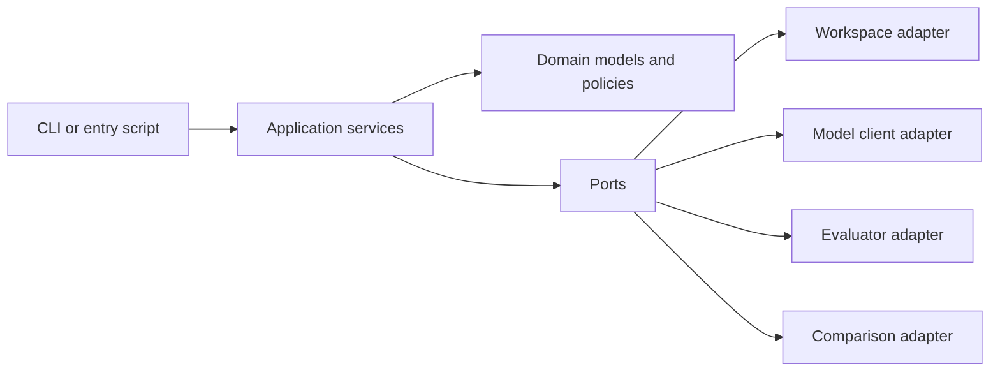
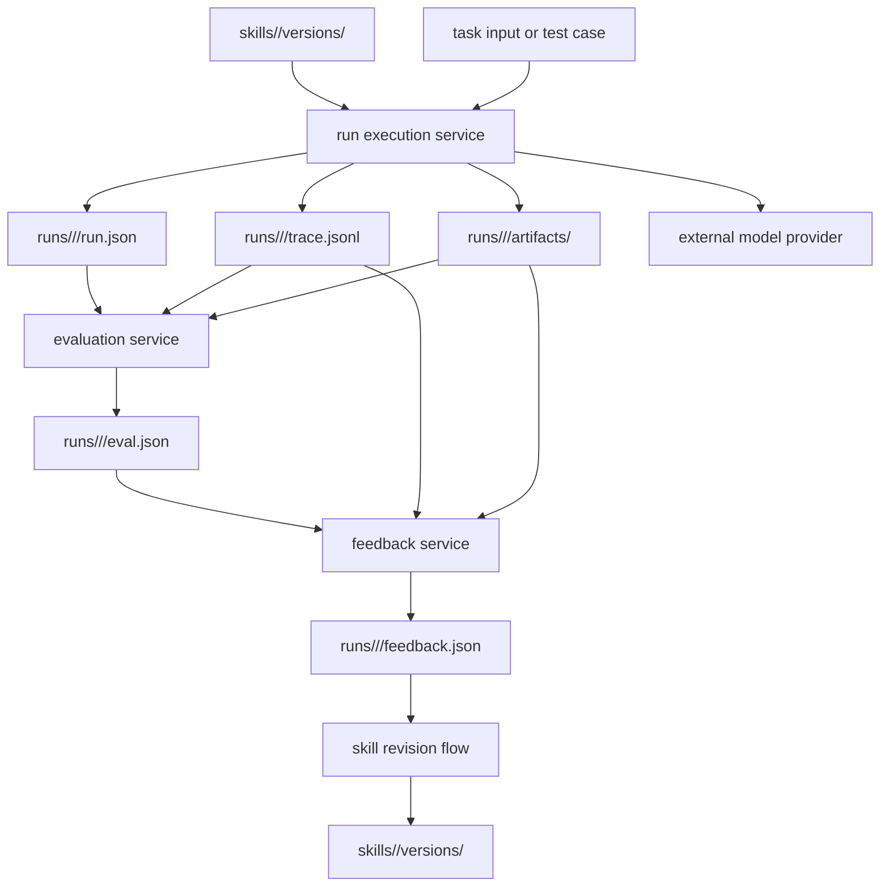
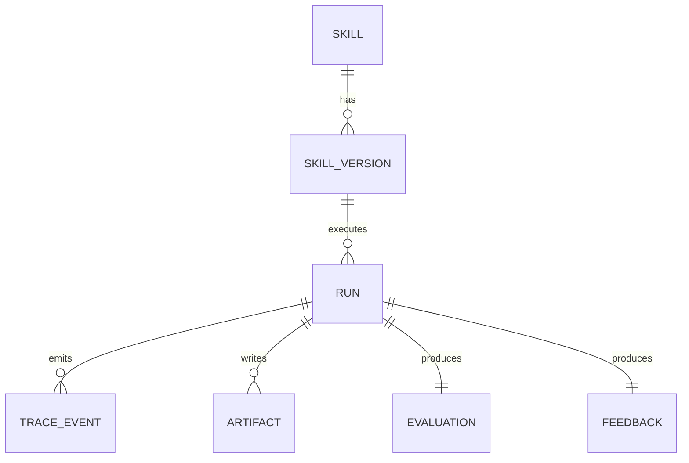

# Architecture Spine - Skill Runtime Evaluation Loop

## Design Paradigm

Use a filesystem-first ports-and-adapters pipeline.

- Domain scope is split into `skills`, `runs`, `evaluation`, `feedback`, and `comparison`.
- Application services orchestrate the lifecycle `ingest -> execute -> evaluate -> feedback -> compare`.
- Ports isolate external effects: model invocation, filesystem persistence, clock/id generation, and optional comparison/report rendering.
- Skill discovery and progressive disclosure use Agent Skills SDK instead of custom ad hoc parsing.
- Adapters stay replaceable; the workspace contract does not.



## Invariants & Rules

### AD-1 - Workspace artifacts are the system of record

- **Binds:** CAP-1, CAP-3, CAP-4, CAP-5
- **Prevents:** hidden runtime state in memory, databases, or ad hoc temp files that downstream agents cannot audit
- **Rule:** Every durable input, output, and derived judgment must live under the workspace folder contract; if a stage cannot be reconstructed from workspace files, the design is non-compliant.

### AD-2 - Runs are append-only during execution and immutable after completion

- **Binds:** CAP-2, CAP-3, CAP-4
- **Prevents:** trace loss, post-hoc mutation of evidence, and disagreement between execution output and evaluation input
- **Rule:** A run may append trace events while active, but once terminal it must never rewrite prior trace or artifact files; later stages write new files instead of mutating execution evidence.

### AD-3 - Skill execution always targets an explicit skill version

- **Binds:** CAP-1, CAP-2, CAP-5
- **Prevents:** running an ambiguous `latest` folder, irreproducible comparisons, and feedback that cannot be tied to a revision
- **Rule:** Every run must reference a concrete skill version identifier and version path; execution against an unversioned working folder is disallowed.

### AD-4 - Model selection is resolved through one runtime port at run start

- **Binds:** CAP-2, CAP-3
- **Prevents:** provider logic leaking across the codebase, per-step model drift inside one run, and hardcoded model assumptions in domain services
- **Rule:** Application services obtain one `ModelClient` from environment-derived config before execution starts, and the effective provider, model, and key non-secret parameters are persisted into `run.json`.

### AD-5 - Pipeline stages own separate schemas and consume prior artifacts only

- **Binds:** CAP-2, CAP-3, CAP-4, CAP-5
- **Prevents:** stage coupling through informal shared objects, evaluation mutating execution output, and feedback bypassing evaluation evidence
- **Rule:** Ingest, execute, evaluate, feedback, and compare each read only source inputs plus prior stage artifacts and write only their own declared artifact set.

### AD-6 - Durable artifact schemas are explicit and versioned

- **Binds:** CAP-1, CAP-3, CAP-4, CAP-5
- **Prevents:** parser drift between small agents, silent shape changes, and ambiguous timestamps or status values
- **Rule:** `run.json`, `eval.json`, `feedback.json`, and each trace event must carry stable field names, schema version markers, and ISO-8601 UTC timestamps.

### AD-7 - Runtime file access is workspace-bounded by policy

- **Binds:** CAP-2, CAP-3
- **Prevents:** skills writing outside the allowed workspace, accidental corruption of unrelated files, and environment-dependent side effects
- **Rule:** All write paths must resolve under configured workspace roots; any attempted escape is rejected and logged as a traceable runtime failure.

### AD-8 - Skill registry and filesystem loading use Agent Skills SDK

- **Binds:** CAP-1, CAP-2
- **Prevents:** custom loader drift from the skill format, loss of progressive-disclosure behavior, and duplicated parsing logic across ingestion and runtime
- **Rule:** The runtime must use Agent Skills SDK as the skill framework, with `agentskills-core` as the registry abstraction and `agentskills-fs` as the local filesystem provider in v1; any custom behavior must sit behind the SDK's provider interfaces.

## Consistency Conventions

| Concern | Convention |
| --- | --- |
| Naming (entities, files, interfaces, events) | Use `snake_case` for Python modules and JSON fields, `PascalCase` for domain types, and `verb_noun` event names such as `trace_started` or `evaluation_completed`. |
| Data & formats (ids, dates, error shapes, envelopes) | Use slug-like ids with UTC timestamp suffixes for runs and versions; use UTF-8 JSON for records, JSONL for append-only traces, and ISO-8601 UTC timestamps everywhere. |
| State & cross-cutting (mutation, errors, logging, config, auth) | Resolve config from environment once per run, capture non-secret effective config into metadata, emit structured error entries into trace/output artifacts, and treat secrets as read-only inputs that are never persisted. |

## Stack

| Name | Version |
| --- | --- |
| Python | 3.12.10 |
| Agent Skills SDK release | 0.2.3 |
| agentskills-core | 0.2.3 |
| agentskills-fs | 0.2.3 |

## Structural Seed





```text
src/
  skill_runtime/
    domain/
      skills.py          # skill package, version, and workspace identities
      runs.py            # run lifecycle and artifact contracts
      evaluation.py      # eval result models and scoring policies
      feedback.py        # feedback result models
    application/
      ingest_skill.py    # skill package loading and validation
      run_skill.py       # orchestrates one execution run
      evaluate_run.py    # orchestrates eval generation
      generate_feedback.py
      compare_runs.py
    ports/
      model_client.py    # provider-neutral model interface
      workspace_store.py # filesystem read/write contract
      evaluator.py       # check runner contract
      id_provider.py
      clock.py
    adapters/
      fs_store.py
      skill_provider_fs.py
      model_client_openai_compatible.py
      rule_evaluator.py
    cli/
      main.py
tests/
  fixtures/
  unit/
  integration/
```

Operational envelope for v1:
- Single-process local or CI execution.
- Local filesystem workspace under one project root.
- One outbound HTTPS dependency to the chosen model provider.
- No background workers, queue, or database.

## Capability -> Architecture Map

| Capability / Area | Lives in | Governed by |
| --- | --- | --- |
| CAP-1 skill ingestion | `application/ingest_skill.py`, `domain/skills.py`, `adapters/fs_store.py`, `adapters/skill_provider_fs.py` | AD-1, AD-3, AD-6, AD-8 |
| CAP-2 runtime execution | `application/run_skill.py`, `ports/model_client.py`, `adapters/model_client_openai_compatible.py` | AD-2, AD-4, AD-7, AD-8 |
| CAP-3 trace and artifact persistence | `domain/runs.py`, `ports/workspace_store.py`, `adapters/fs_store.py` | AD-1, AD-2, AD-6, AD-7 |
| CAP-4 evaluation and comparison | `application/evaluate_run.py`, `application/compare_runs.py`, `adapters/rule_evaluator.py` | AD-1, AD-5, AD-6 |
| CAP-5 feedback and revision loop | `application/generate_feedback.py`, skill version storage under `skills/` | AD-3, AD-5, AD-6 |

## Deferred

- Concrete provider SDK choice beyond a single initial adapter implementation can wait until the v1 provider decision is made, because AD-4 already fixes the seam.
- Automatic test/example generation is deferred out of the hot path; v1 may start with curated fixtures and still satisfy the hero loop.
- Rich HTML reporting, dashboards, and artifact explorers are deferred because the workspace itself is the primary audit surface in v1.
- Git-backed versioning policy is deferred; the architecture requires explicit skill versions in the workspace, but whether git also becomes authoritative can wait.
- Raw prompt capture default is deferred; the invariant is that traceability exists, not that full prompt bodies are always persisted in v1.
- `agentskills-mcp-server`, LangChain integration, and Microsoft Agent Framework integration are deferred; v1 uses Agent Skills SDK directly inside the local Python runtime.
